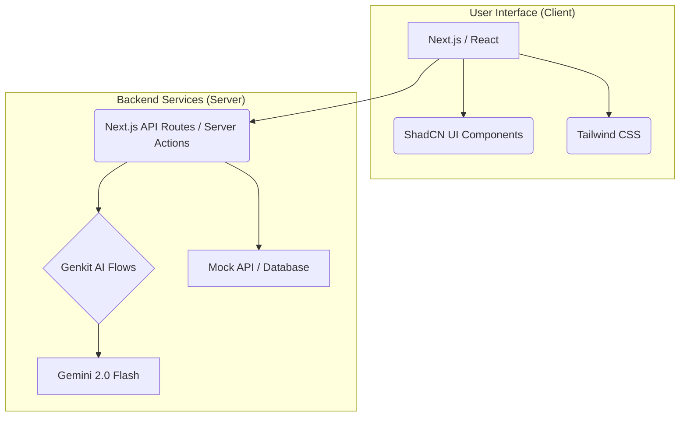
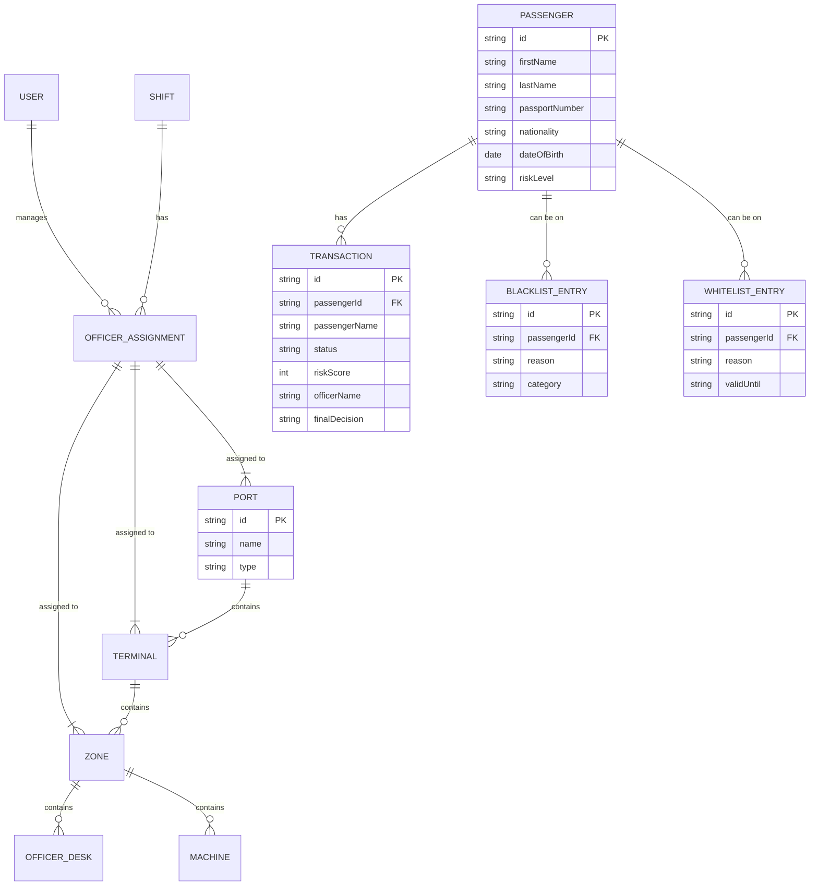
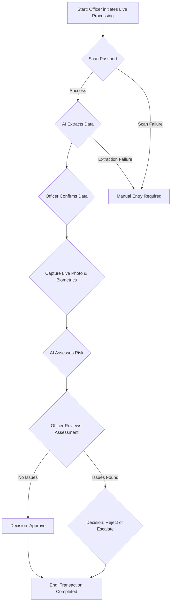

# Business Requirements Document (BRD)
## Guardian Gate Unified Border Control System

---

### 1. Executive Summary
This document provides a comprehensive analysis and technical specification for the **Guardian Gate Unified Border Control System**. It is intended for technical stakeholders, including solution architects, developers, and project managers, to guide the development, integration, and deployment of the platform. Guardian Gate is a modular, web-based application designed to unify and streamline border control operations across multiple entry points, leveraging AI for enhanced security and operational efficiency. This BRD outlines the system's architecture, functional modules, user roles, data entities, business rules, and key process flows.

---

### 2. System Overview

#### 2.1 System Architecture
Guardian Gate is a modern, web-based application built on a prescribed technology stack.

-   **Frontend:** Next.js with React and TypeScript, using the App Router for server-centric rendering.
-   **UI Components:** ShadCN UI for pre-built, accessible components.
-   **Styling:** Tailwind CSS for utility-first styling, with a themable color scheme defined in `globals.css`.
-   **AI/Generative AI:** Google's Genkit framework, specifically using Gemini 2.0 Flash models for data extraction and risk assessment.
-   **Backend & Data:** Currently mocked via `mock-api.ts`. The architecture anticipates a transition to a robust backend (e.g., Firebase Firestore for database, Cloud Functions for services).
-   **Deployment:** Firebase App Hosting.

*Textual Description: The system is a client-server application. The client is a Next.js/React single-page application using ShadCN UI components and Tailwind CSS. The server-side logic, including AI processing via Genkit and data access, is handled by Next.js server components and actions which currently interface with a mock API.*

#### 2.2 Key Functionalities
- **Multi-Module Operations:** Tailored interfaces for Airport, Landport, Seaport, E-Gate, Control Room, and Analyst users.
- **Role-Based Access Control (RBAC):** Granular permission system controlling access to modules and actions.
- **Live Transaction Processing:** AI-assisted workflow for real-time passenger processing.
- **Data Management:** Centralized management of Passengers, Blacklists, Whitelists, and System Configuration.
- **Dashboards & Analytics:** Module-specific dashboards with KPIs, charts, and predictive analytics.

---

### 3. Stakeholders & User Roles
| Role | Description | Key Responsibilities |
| :--- | :--- | :--- |
| **Admin** | System administrator with full access. | User management, system-wide configuration (ports, terminals, machines), oversees all modules. |
| **Shift Supervisor** | Manages a team of officers for a specific module. | Manages officer workloads, reviews escalated transactions, monitors operational efficiency. |
| **Officer** | Front-line staff at border checkpoints. | Processes passengers and vehicles, performs document checks, makes entry/exit decisions. |
| **Control Room Operator**| Monitors overall system status. | Oversees E-Gate operations, responds to system alerts, monitors traffic flow. |
| **Analyst** | Data and security analyst. | Reviews historical data, identifies security trends, analyzes system performance. |

---

### 4. Functional Modules & Pages

#### 4.1 Login Page (`/login`)
- **Description:** Secure entry point for all users.
- **Actions:**
    - **Sign In:** Authenticates user credentials against the backend. On success, redirects to the user's default module dashboard. On failure, displays an error message.
    - **Forgot Password:** (Placeholder) Navigates to a password recovery flow.
    - **Biometric Login:** (Placeholder) Initiates a biometric authentication flow.
- **Entities:** `User`
- **Business Rules:**
    - Authentication is mocked but must be replaced with a secure production service.
    - User access is determined by the `modules` and `permissions` arrays in their `User` profile.

#### 4.2 Airport Module (`/airport`)
- **Description:** Manages all air travel-related border control operations.
- **Key Pages & Features:**
    - **Dashboard (`/dashboard`):** Displays KPIs like passengers processed, flights monitored, security alerts, and various performance charts.
    - **Live Processing (`/transactions/live-processing`):** An AI-driven workflow for officers to process passengers.
    - **Transactions (`/transactions`):** A data table to view, search, and manage all historical airport transactions.
    - **Passenger Management (`/passengers`):** CRUD operations for passenger records.
    - **Blacklist/Whitelist (`/blacklist`, `/whitelist`):** Management of restricted and pre-approved passenger lists.
    - **Workload Management (`/workloads`):** Tools for shift creation and officer assignments.
    - **Predictive Analytics (`/prediction`):** Forecasts on passenger flow and processing times.

#### 4.3 Landport, Seaport, E-Gate Modules
- **Description:** These modules mirror the functionality of the Airport module but are tailored to their specific contexts (vehicles, vessels, automated gates). They share many of the same components and workflows.

#### 4.4 User Management Module (`/users`)
- **Description:** Allows administrators to manage user accounts.
- **Actions:**
    - **Add User:** Navigates to the `/users/add` page.
    - **Edit User:** Navigates to the `/users/edit/[id]` page.
    - **View Details:** Opens a side sheet with the user's modules and permissions.
    - **Delete User:** Opens a confirmation dialog before deleting the user record.
- **Entities:** `User`
- **Business Rules:**
    - Access is restricted to users with the `users:manage` permission.

---

### 5. Data Entities & Validation Rules

#### 5.1 Entity-Relationship Diagram (ERD)

*Textual Description: A `PORT` contains many `TERMINAL`s, which contain many `ZONE`s. `ZONE`s contain `OFFICER_DESK`s and `MACHINE`s. `USER`s are assigned to shifts and locations via `OFFICER_ASSIGNMENT`. `PASSENGER`s are the central entity, linked to `TRANSACTION`s and optionally to `BLACKLIST_ENTRY` or `WHITELIST_ENTRY` records.*

#### 5.2 Key Entity Tables

**`Passenger`**
| Field | Type | Validation Rules | Description |
| :--- | :--- | :--- | :--- |
| `id` | string | UUID | Primary Key |
| `firstName` | string | Not empty | Passenger's first name |
| `lastName` | string | Not empty | Passenger's last name |
| `passportNumber`| string | Not empty | Unique passport number |
| `nationality` | string | 3-letter ISO code | Country of nationality |
| `dateOfBirth` | string | YYYY-MM-DD format | Date of birth |
| `riskLevel` | enum | Low, Medium, High | System-calculated risk level |
| `status` | enum | Active, Inactive, Flagged | Current status of the passenger record |

**`Transaction`**
| Field | Type | Validation Rules | Description |
| :--- | :--- | :--- | :--- |
| `id` | string | UUID | Primary Key |
| `passengerId`| string | Foreign Key to `Passenger` | The passenger being processed |
| `status` | enum | Completed, Failed, Pending | Status of the transaction |
| `riskScore` | number | 0-100 | AI-generated risk score |
| `finalDecision`| enum | Approved, Rejected | Final decision made by the officer |
| `officerName` | string | Not empty | Name of the processing officer |

**`User`**
| Field | Type | Validation Rules | Description |
| :--- | :--- | :--- | :--- |
| `id` | string | UUID | Primary Key |
| `name` | string | Not empty | User's full name |
| `email` | string | Valid email format | User's login email |
| `role` | enum | See `Role` type | User's primary role |
| `modules` | array | Array of `Module` strings | Modules accessible to the user |
| `permissions` | array | Array of `Permission` strings| Specific actions the user can perform |

---

### 6. Integrations & Interfaces

#### 6.1 Internal Interfaces
- **AI Flows (`/src/ai/flows`):**
    - `extractPassportData`: Takes a passport image and returns structured JSON data.
    - `assessPassengerRisk`: Takes passenger details and photos, performs a face match, and returns a risk score and recommendation.
    - `flagEdgeCaseResponse`: Analyzes API responses for potential security anomalies (future implementation).

#### 6.2 External Interfaces
- **National Watchlist Database (Future):** The system must be able to query an external national watchlist API using passenger details. The schema and authentication method for this API are currently undefined.
- **Visa Information System (Future):** An interface to a national or international visa database is required to verify visa status for required nationalities.
- **Hardware APIs (Future):** Protocols for communicating with physical hardware (passport scanners, biometric cameras, E-Gates) must be defined and implemented. This is currently mocked.

---

### 7. Business Rules & Constraints

- A passenger's risk level is determined by the `assessPassengerRisk` AI flow.
- A transaction with a "Rejected" outcome must include officer notes.
- Transactions with a high risk score or critical alerts can be escalated to a Duty Manager.
- User access is strictly controlled by the `permissions` array associated with their `role`. A user cannot access a module or perform an action without the explicit permission string.
- All development must adhere to the prescribed tech stack (Next.js, Tailwind, ShadCN, Genkit).

---

### 8. Process Flows & Diagrams

#### 8.1 Live Transaction Processing Flow

*Textual Description: The process begins with scanning a passport. AI extracts the data, which is confirmed by the officer. Live biometrics are captured. The AI then assesses risk based on all information. The officer reviews the AI's recommendation and makes a final decision (Approve, Reject, or Escalate). The transaction is then logged.*

---

### 9. Assumptions & Open Points

- **Assumption:** The mock API (`mock-api.ts`) accurately reflects the data schemas and relationships required for a production-ready system.
- **Assumption:** The Genkit AI models configured in the prototype (Gemini 2.0 Flash) are approved for use and will be available and performant in the production environment.
- **Open Point/Missing Information:** The specific protocols and API contracts for interfacing with physical hardware (scanners, cameras, E-Gates) are not defined. This requires a separate hardware integration specification.
- **Open Point/Missing Information:** The details for third-party system integrations (e.g., national watchlist APIs, visa databases) are not defined. A dedicated discovery and integration phase will be required.
- **Assumption:** The current role and permission structure is complete and accurate. It should be reviewed and signed off by business stakeholders before backend implementation.

