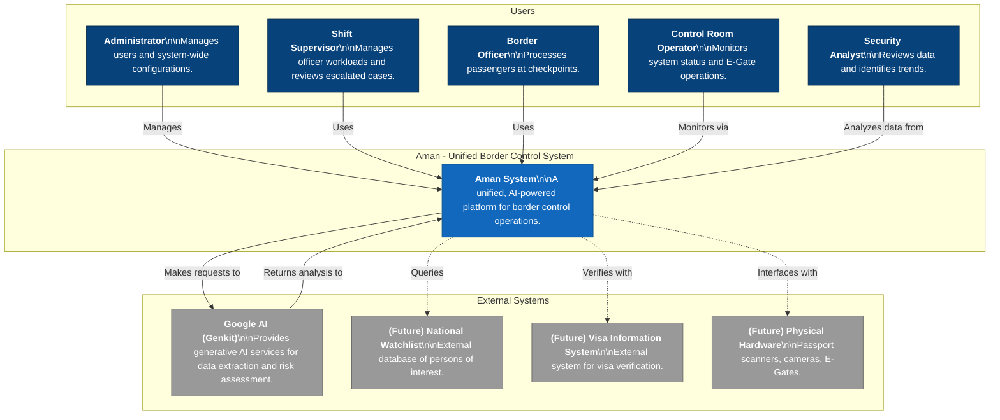
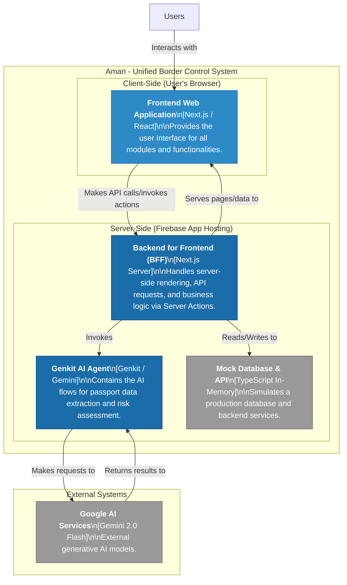
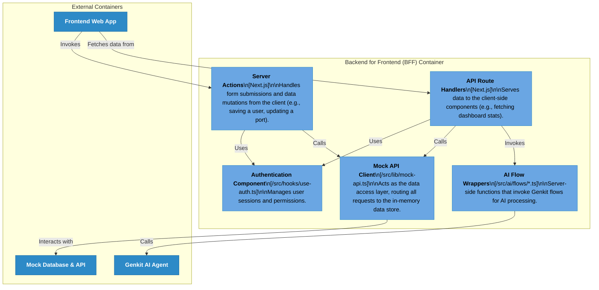

# C4 Model: Aman Unified Border Control System

This document outlines the architecture of the Aman system using the C4 model for visualizing software architecture.

---

## Level 1: System Context

This diagram shows the Aman system as a black box in its environment, interacting with users and external systems. It illustrates the high-level boundaries of the system.

---

## Level 2: Container Diagram

This diagram zooms into the Aman system, breaking it down into its high-level containers (applications, data stores, APIs).

---

## Level 3: Component Diagram (Backend for Frontend)

This diagram decomposes the **Backend for Frontend (BFF)** container, showing its main components and their interactions.

This C4 model provides a clear, layered view of the Aman system's architecture, from the highest-level context down to the key components within the backend.